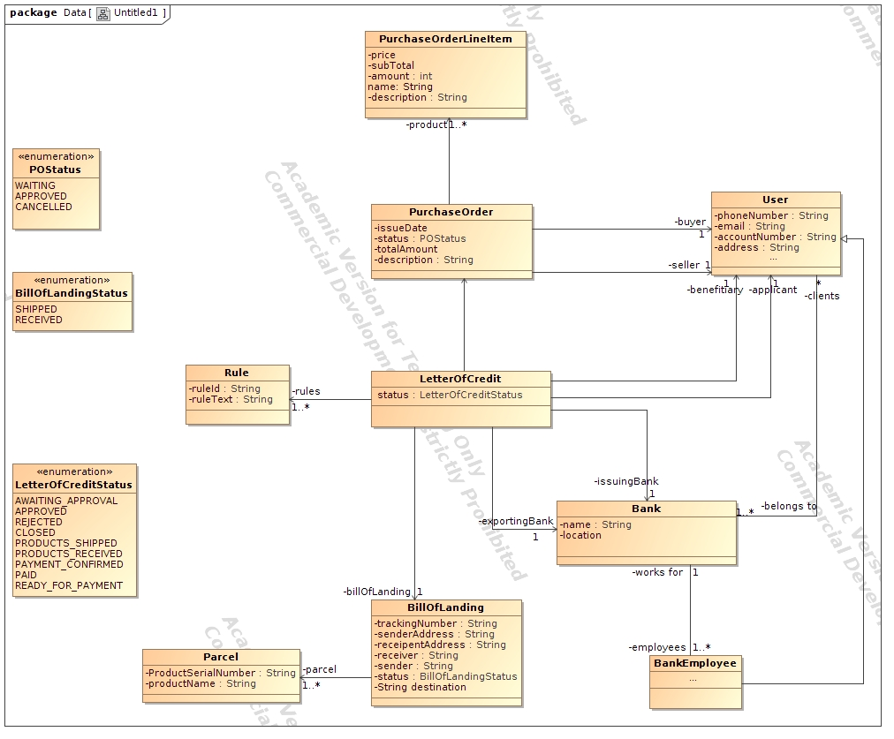
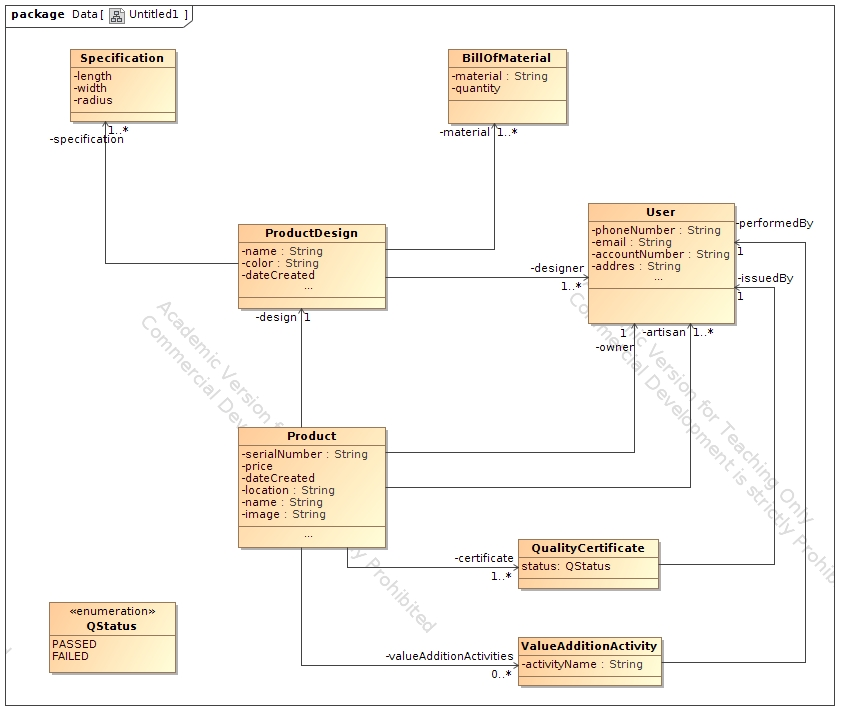

# Blockchain-based Provenance application.
An application that uses Blockchain(Hyperledger fabric) to determine the provenance of handcraft
Jewellery.

## Domain Model



## project structure
```
|---network
|---chaincode
|---client-applications
|---installer
```
`network` -> contains the code for setting up the docker containers required.

`chaincode` -> contains the code for the smart contract(bussines logic).

`installer` -> contains script installing the network and creating network admins.

## Setup

### Requirement
- [GoLang](https://golang.org/)
- [Docker](https://www.docker.com/get-started)
- [Docker compose](https://docs.docker.com/compose/install/)
- [Node.js](https://nodejs.org/en/download/)
- [Curl](https://curl.haxx.se/download.html)

if you are using ubuntu, you can install all the dependencies by running the following script.

`curl -O https://hyperledger.github.io/composer/latest/prereqs-ubuntu.sh`

In order to run the script above, you may need to give it permission to execute. i.e `chmod a+x prereqs-ubuntu.sh`.

### Network Setup
- Download Hyperledger fabric samples and all the Docker images required using the command below. 

    `curl -sSL https://goo.gl/6wtTN5 | bash -s 1.1.0 1.1.0  0.4.6`

- clone the repository `git clone https://github.com/ivangsp/provenance-Jewellary`.

- move to the network folder ie `cd provenance-Jewellary/network/`.

- Generate certificates for all the peers and order by running this command `./byfn.sh -m generate`

- starting the Network  using this command `./byfn.sh -m up -s couchdb -a`. This will create all the  docker containers required. 

- If you want to stop the network, use `./byfn.sh -m down`.

### Setting up the admin users and installing the chaincode(smart contract)
- We used [hyperledger composer](https://hyperledger.github.io/composer/v0.19/installing/installing-index) to write the smart contract. In order to install the smart contract on the network, we first need to create network admins using the certificate we created earlier.

- To easen the process, we wrote a script file `installer/create-cards.sh`. To run the script, move the installer folder execute the script i.e `cd installer && ./create-cards.sh`.

- You can read the script file if you want to know exactly what's going on. You can read more from [composer site](https://hyperledger.github.io/composer/v0.19/tutorials/deploy-to-fabric-multi-org).

### Running the server.
Using composer we can generate rest-api that connects to our blockchain.

`composer-rest-server -c artisanAdmin@trade-network -p 3000` The above command generates a rest-api Using `artisanAdmin` as the admin for the network.

You can run multiple sites using different cards.

### Running the Client application.

The application contains two client application that use React. Navigate to client-application and then move to any of the client application. ie `cd client-applications/artisan`

- Install all the depedencies `npm install`.

- Run the application using `npm start`.


